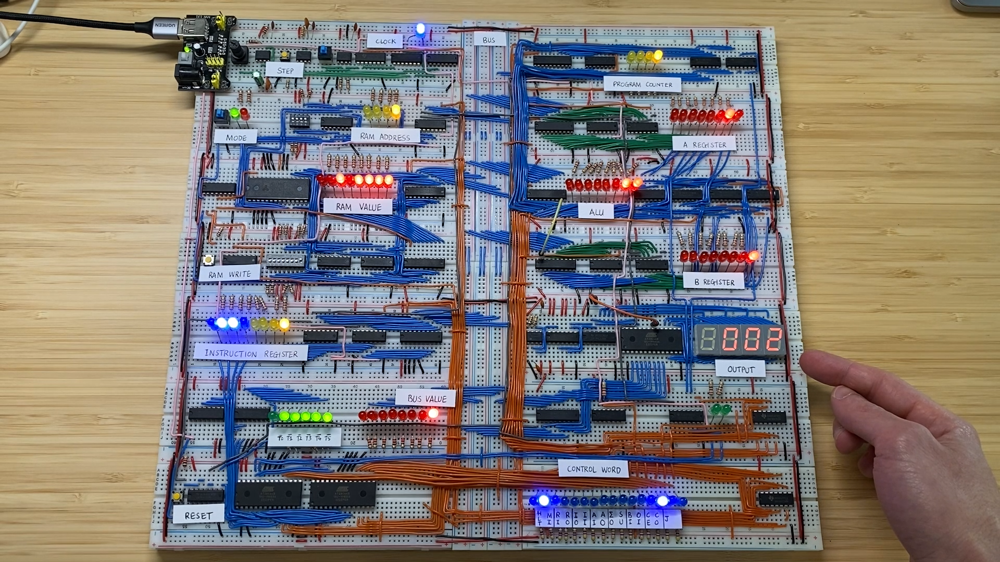

# Programmable Breadboard Computer

## Introduction

This page showcases a fully functional programmable computer built with breadboards and simple
electronics components. It was inspired by [Ben Eater's work](https://eater.net/8bit) but adapted
based on the what components were readily available. Check out my walk-through video to see it in
action and give me a star if you enjoy it!

[](https://www.youtube.com/watch?v=gfXwxyk_Bkw)

## Motivation

In my last years of school, I had primarily studied maths and science and was on track to study some
kind of engineering. However, growing up in Abu Dhabi where most engineers were either mechanical,
civil or chemical engineers, I didn't really see myself working in any of those fields. Instead I
decided to try something different and chose to study economics and finance at university.

While I decided to step away from engineering, my love of creating things never stopped. At the
end of my degree, I began to fall in love with software and how it allowed me to create and
control so much while sitting at a computer. In 2017, I decided that I needed to be part of this
world and began learning to program through online courses and lots of building. I'm proud to say
that I was able to develop strong practical skills in programming.

But as a self-taught programmer, I always felt that there was something missing in my education.
What was actually happening inside the computer to make my code work?

That was the nagging question that motivated this project in 2021. And if I've learned anything
about technology over the years, it's that you learn best by building.

## The Computer

The goal of the project was to build a computer that is as simple as possible while still being
programmable like any other you might use at home. With electronic components, you always have the
option to decide what level of abstraction you want to work at. This computer is built with simple
electronic components, forcing me to deeply learn about each part.

So what components do you need to make a simple computer?

- **Clock:** The clock module ensures that all the components are synchronised with each other.
  The clock creates a recurring on-off signal that the rest of the components listen to. Most change
  in state in the computer happens when the clock signal moves from off to on.

- **Registers:** A register is a simple memory cell that is used for for a specific task. In this
  computer, each register holds 8-bits of data. The different registers and their purpose is
  explained in each component description below.

- **Arithmetic & Logic Unit (ALU):** The ALU is that part of the computer that _computes_ things.
  It has three different registers: the A register, B register and sum register. An ALU typically
  can do a variety of calculations such as addition, subtraction, multiplication etc. In this
  computer, the ALU can add (A + B) or subtract (A - B). The result of the calculation is stored
  in the sum register which can be output to other components.

- **Random Access Memory (RAM):** The RAM is the main memory a computer uses while operating. It
  stores the program itself and the data that program needs to achieve its task. The RAM only
  holds memory while the computer has power. In this computer, the RAM is the _only_ memory, which
  means you need to load the program each time you want to run it!

- **Bus:** The bus of a computer connects all the components together. It's basically a data highway
  where each component can read from or write to it. So if you want to get data from the RAM to the
  one of the ALU registers to do a calculation with it, you need to send it through the bus.

- **Program Counter:** The program counter is also a register. Its job is to store which
  instruction is being executed. At the beginning this would have a binary 0 stored in it and the
  computer would increment it by 1 during each instruction.

- **Control:** The control logic is the _brain_ of the computer. It includes an instruction
  register, an instruction decoder and connections to each component to control them. Each
  instruction is read from RAM and broken down into 6 micro-operations. Each of these
  micro-operations does something needed to fulfil the instruction, for example load a value from
  RAM to the A register. Each component in the computer exposes a number of inputs that
  allow the control logic to control them using a digital signal. For example, the RAM has a control
  input to read data from the bus and a control input to write data to the bus. Each micro-operation
  is defined by a series of control signals that together are called the control word. Each os these
  signals is either off or on depending on whether the micro-operation needs to control a particular
  component. Once the 6 micro-operations are complete, the instruction has been executed.

## Writing a Program

One of the really fun parts of building this computer was creating an instruction set for
it. An instruction set is a set of instructions that the computer understands how to execute.
A program for this computer, is a series of instructions and operands.

To create this instruction set, we define a series of op-codes that the computer will understand.
For this computer, it understands the following instructions:

| Instruction | Opcode | Description                                                         |
| ----------- | ------ | ------------------------------------------------------------------- |
| NOP         | 0      | No operation                                                        |
| LDA         | 1      | Load operand from RAM into A register                               |
| ADD         | 2      | Load operand from RAM and add to A register                         |
| SUB         | 3      | Load operand from RAM and subtract from A register                  |
| STA         | 4      | Store A register data to RAM at operand address                     |
| LDI         | 5      | Load operand into A register as literal value                       |
| JMP         | 6      | Jump - set program counter to operand. Useful for conditional logic |
| JC          | 7      | Jump but only if the last calculation overflowed                    |
| JZ          | 8      | Jump but only if the last calculation resulted in zero              |
| ...         | ...    | ...                                                                 |
| OUT         | 14     | Output data from A register to the decimal display                  |
| HLT         | 15     | Halt the program                                                    |

Writing a program for this computer and then translating it to machine code can be painful. To
help with this task, I've written a
[simple command-line assembler](https://github.com/johnjudeh/jasm) called `jasm`, i.e. John's
assembler.

The assembler takes a program written in assembly code, like this program to add 1 forever:

```
LDI 0
ADD 15
OUT
JMP 1

DTA 15 1   increment
```

And translates it to machine code which can be input into the computer's RAM manually.

```bash
./jasm.py example_programs/add_forever
ADDRESS  INSTRUCTION  ASSEMBLY
0000     0101 0000    LDI 0
0001     0010 1111    ADD 15
0010     1110 0000    OUT
0011     0110 0001    JMP 1
1111     0000 0001    DTA 15 1 increment
```

## Related Repos

- **[jasm](https://github.com/johnjudeh/jasm)**: An command-line assembler for the breadboard
  computer
